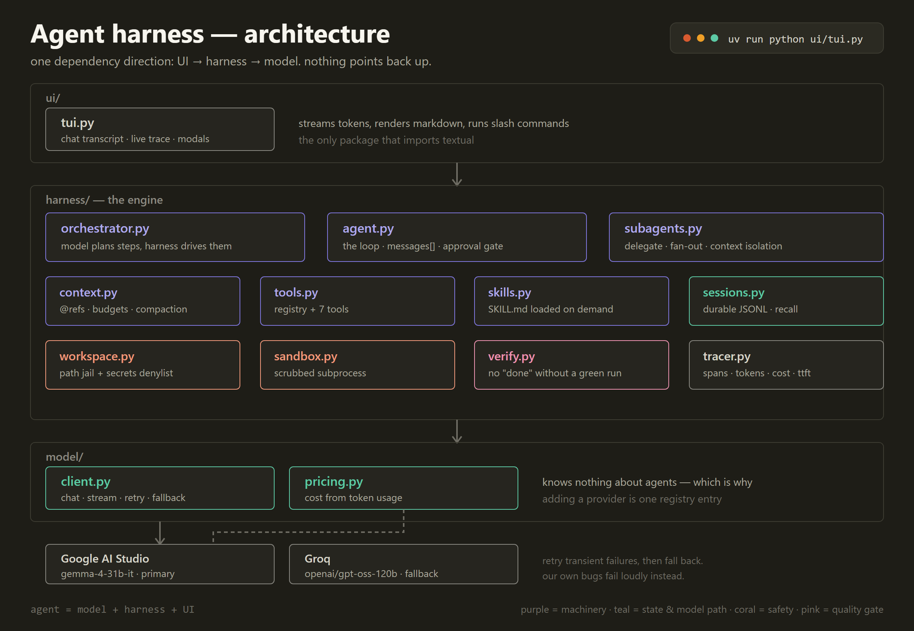

# harness

A minimal agent harness, built from an empty file one primitive at a time — in Python,
with no agent frameworks. The point is to understand how harnesses work by writing one,
so every piece is the smallest version that still reveals the mechanism.

The model never changed across the whole build. The harness is what turns it into an agent.



## The idea

Three packages, one dependency direction: **UI → harness → model**. Nothing points back up.

- **`model/`** — talking to LLM providers, and nothing else. It has no idea an agent exists,
  which is why adding a provider is a single registry entry.
- **`harness/`** — the engine: the loop, tools, context management, security, memory,
  planning, subagents, verification, tracing.
- **`ui/`** — the terminal chat client. The only package that imports `textual`.

## Running it

Needs [uv](https://docs.astral.sh/uv/) and a free [Google AI Studio](https://aistudio.google.com)
key. A [Groq](https://console.groq.com) key is optional — it's the fallback provider.

```bash
uv sync
```

Then create a `.env` in the project root:

```
GOOGLE_API_KEY=your-key
GROQ_API_KEY=your-key   # optional, used when Google fails
```

Start the chat UI:

```bash
uv run python ui/tui.py
```

Type `/help` for commands. `escape` cancels a turn, `ctrl+t` toggles the trace pane.

## What's in it

| Piece | What it does |
|---|---|
| **Agent loop** | Messages accumulate in a list that is re-sent every turn. That list is the memory. |
| **Tools** | A tool is a function plus a schema. The model requests one as JSON; the harness decides whether to run it. |
| **Approval gate** | Anything dangerous — file writes, shell commands — waits for a human. Denies by default. |
| **Context management** | Over budget, the middle of the conversation is summarized and the head and tail kept verbatim. |
| **Instructions** | A layered system prompt: built-in text plus the project's `AGENTS.md`. |
| **`@` references** | `@path/to/file` reads that file into the model's view before the question. |
| **Skills** | Procedures in `SKILL.md`. Only the name and one-line description sit in the prompt; the body loads on demand. |
| **Security** | Every file path goes through a workspace jail with a secrets denylist. Shell commands run in a scrubbed subprocess. |
| **Sessions** | Conversations persist as JSONL and survive a restart. Keyword search works across all past sessions. |
| **Orchestrator** | The model plans steps as JSON; the harness drives them, gating and retrying. |
| **Subagents** | `delegate` and `fan_out` run subtasks in isolated contexts and return only the answer. |
| **Verification** | "Done" isn't accepted until a real test command runs and actually passes. |
| **Observability** | Every model and tool call becomes a span with duration, tokens, cost, and time-to-first-token. |
| **Streaming + fallback** | Replies stream token by token. Transient failures retry, then fall back to the next provider. |

## Demos

One runnable script per concept, in `demos/`. Each is small enough to read in a minute.

```bash
uv run python demos/demo_skills.py         # the model loads a skill only when it's relevant
uv run python demos/demo_compaction.py     # a fact survives the middle being summarized away
uv run python demos/demo_sandbox.py        # secrets refused, shell env scrubbed
uv run python demos/demo_fallback.py       # retry, fall back, and when to do neither
uv run python demos/demo_subagents.py      # two subtasks in parallel, isolated
uv run python demos/demo_observability.py  # spans with tokens and cost
```

## Notes on what this isn't

It's a learning repo, not a product. A few things are deliberately honest about their limits:

- The shell sandbox scrubs the environment but, without Docker, gives no real network or
  filesystem isolation. The approval gate is the actual boundary.
- Tool calls are parsed out of the model's text rather than using native function calling,
  which works with any model but is more fragile.
- Tool failures come back as strings that look like successes. The client layer has proper
  error types; the tool layer doesn't yet.

## Layout

```
model/     client.py  pricing.py
harness/   agent.py  context.py  tools.py  workspace.py  sandbox.py
           sessions.py  skills.py  tracer.py  orchestrator.py
           subagents.py  verify.py
ui/        tui.py
demos/     one script per concept
skills/    skill content (SKILL.md), not code
```

Split a file into a folder only when it earns it — roughly 350 lines, or two concerns inside
it that change for different reasons.
